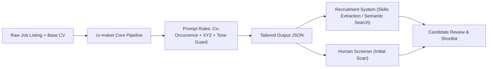

# Engineering & Product Report: Pull Request #16
**Upgrade System & User Prompts with Modern ATS Vector Guidance and Recruiter Tone Rules**

- **Repository**: [`naheedroomy/cv-maker`](https://github.com/naheedroomy/cv-maker)
- **Pull Request**: [#16](https://github.com/naheedroomy/cv-maker/pull/16) (Merged into `master`)
- **Merge Commit**: `22d24b7`
- **Scope**: Core AI Pipeline Prompt Engineering (`core/pipeline.py`), Unit Test Suite (`tests/test_pipeline.py`)

---

## 1. Executive Summary

As the hiring ecosystem enters the "Age of AI", applicant screening faces two distinct evaluation layers:
1. **Semantic & Skills-Matching Systems**: Some modern recruitment tools support semantic search, vector embeddings, and skills extraction rather than naive exact-keyword matching. They evaluate contextual relevance, semantic co-occurrence, and verified experience.
2. **AI-Fatigued Human Recruiters & Hiring Managers**: Recruiters scanning CVs quickly (often within 6 to 8 seconds) have grown skeptical of generic, LLM-generated clichés (*"spearheaded"*, *"orchestrated"*, *"leveraged"*, trailing qualifier clauses). CVs dominated by boilerplate phrasing reduce recruiter confidence.

PR #16 upgrades `cv-maker`'s internal prompt pipeline to produce CVs aligned with these realities: encouraging context-rich, evidence-backed engineering descriptions while curbing obvious AI clichés and passive trailing fluff.

> **Note on Verification & Scope**: Automated tests confirm that these instructions appear across CLI, Chat, and Staged prompt builders. Prompt guidance alone cannot guarantee factual accuracy or vendor-specific ATS ranking gains: candidate review of all generated bullets, scopes, and technologies remains essential before submitting an application.

---

## 2. Research Context & Industry Dynamics

Modern recruitment platforms differ widely in architecture, scoring configuration, and human-in-the-loop workflows:

### Contextual Considerations
- **Semantic Clustering vs. Isolated Keywords**: Skills extraction algorithms evaluate context. Mentioning a primary technology (e.g., `Kubernetes`) alongside naturally related ecosystem tools verified in the candidate's base CV (e.g., `Helm`, `Ingress`, `RBAC`) provides richer semantic evidence than isolated keyword repetition.
- **Recent Experience Prioritization**: Human screeners and matching algorithms value recent practical experience. Highlighting verified skills in recent roles is beneficial, but historical role accuracy and true dates must be strictly preserved—older skills must never be artificially migrated into recent roles.
- **The LLM Tone Tell**: Experienced engineering screeners easily spot repetitive LLM tropes:
  - Overblown buzzwords: *spearheaded*, *orchestrated*, *leveraged*, *championed*, *synergized*.
  - Passive trailing qualifiers: *"...ensuring optimal performance and reliability"*, *"...driving organizational excellence"*.
  - Punctuation artifacts: over-indexing on em-dashes (`—`).
- **Avoiding Unsubstantiated Scope**: Fabricating numbers or unverified technical scopes (e.g., adding multi-AZ architecture or Kubernetes when the base CV does not establish them) undermines candidate credibility in technical interviews. If metrics are absent, impact must be framed through verifiable technical actions already grounded in the base CV.

---

## 3. Core Upgrades Implemented

### 3.1. Vector Match Optimization via Semantic Co-Occurrence
*Modified: `_RULES["keyword_policy"][0]`*
- Instructs the model to pair target job technologies with candidate-verified ecosystem technologies:
  - **Kubernetes**: paired with `Helm`, `Ingress`, `HPA`, `RBAC`, or `ArgoCD`.
  - **Terraform**: paired with `modules`, `state locking`, `S3/DynamoDB backends`, or `drift detection`.
  - **CI/CD**: paired with `GitHub Actions/GitLab CI`, `reusable workflows`, `automated testing`, or `artifacts`.
  - **Observability**: paired with `Prometheus`, `Grafana`, `alerting rules`, `metrics/logs/traces`, or `SLOs`.
  - **Cloud Architecture**: paired with `VPCs`, `multi-AZ`, `least-privilege IAM`, `security groups`, or `ALBs`.

### 3.2. 3-Part Summary Anchor Formula
*Modified: `_RULES["summary"][2, 3, 4]`*
Standardized summary requirements into a 3-part anchor structure (2–4 dense sentences at levels 2–3):
1. **Professional Anchor**: Target role title, verified total years of experience, and primary engineering domain.
2. **Core Stack Matrix**: Top Tier 1 tools and architectural paradigms verified in the base CV.
3. **Scale & Caliber Anchor**: Concrete throughput, reliability, or business impact anchor supported by the base CV.

### 3.3. Anti-AI Screening & Tone Rules
*Modified: `_RULES["tone"][2]`*
- **Banned AI Verbs**: Prohibits overused clichés: `spearheaded`, `orchestrated`, `leveraged`, `championed`, `pioneered`, `facilitated`, `utilized`, `fostered`, `navigated`, and `synergized`.
- **Engineering-Native Verbs**: Enforces concrete action verbs: `built`, `engineered`, `architected`, `deployed`, `migrated`, `automated`, `reduced`, `refactored`, `configured`, `eliminated`.
- **Banned Syntactic Patterns**: Disallows trailing qualifier fluff (*"ensuring reliability and scalability"*) and restricts excessive em-dash usage.

### 3.4. Google XYZ Structure & Safe Scale Fallback
*Modified: `_RULES["bullet_strategy"][0]`*
- **Google XYZ Structure**: Recommends formatting accomplishments as *Accomplished [X] as measured by [Y], by doing [Z]* when metrics exist in the base CV. If no metrics exist, models must use *Accomplished [X] by doing [Z]* rather than inventing [Y].
- **Front-Loading**: Front-loads technical action verbs or outcomes in the first 4–5 words for rapid scanning.
- **Safe Non-Numeric Scale Fallback**: When quantitative metrics are absent, the prompt directs the model to anchor impact through concrete technical scope already supported by the base CV (e.g., modular configurations, multi-environment setups, standardized templates). It explicitly forbids introducing advanced architectural scopes (such as multi-AZ, multi-region, or clustering) unless confirmed in the base CV for that role.

### 3.5. Role Recency & History Integrity
*Modified: `_RULES["bullet_strategy"][0]`*
- Prioritizes target technologies in current or recent roles whenever supported by verified base-CV evidence for those roles.
- Explicitly forbids migrating or fabricating technologies into recent roles if the evidence only exists in an older role; true historical roles and dates are strictly preserved.

### 3.6. Recruiter Red-Team Self-Check Audit
*Modified: `_build_prompt`, `_build_system_prompt_for_chat`, and `_build_stage3_prompt`*
- Introduced a consistent pre-flight self-check across all prompt paths:
  - **6-Second Glance**: Primary Tier 1 tools bolded in latest role bullets, while summary remains plain text (consistent with the canonical rule: no bold in summary).
  - **AI-Cliché Check**: Banned AI verbs and trailing fluff clauses eliminated.
  - **Front-Loading Check**: Bullets lead with strong engineering verbs or metrics within the first 4–5 words.
  - **Defensibility Check**: Every technical scope and metric strictly defensible from the base CV with zero hallucination.

### 3.7. Evidence-Grounded Style Anchor Example
*Modified: `_build_prompt` and `_build_system_prompt_for_chat`*
- Replaced the previous example with a grounded **Before / Base Evidence / After** pattern ensuring that every technical noun in "After" is directly traceable to the base evidence:
  - **BEFORE**: *"Configured Terraform for cloud provisioning across development and production environments"*
  - **BASE EVIDENCE**: *Base CV states candidate authored modular Terraform files for AWS infrastructure.*
  - **AFTER**: *"Engineered modular **Terraform** configurations to provision AWS infrastructure across development and production environments."*

---

## 4. Code & Architecture Diff Summary

| File | Changes | Description |
| :--- | :--- | :--- |
| [`core/pipeline.py`](core/pipeline.py) | `_RULES`, prompt builders | Added semantic co-occurrence rules, 3-part summary formula, banned AI verb lists, safe scale fallback without unverified scopes, recency guidance without quotas, base-evidence style anchor, and recruiter red-team self-checks across CLI, chat, and staged prompts. |
| [`tests/test_pipeline.py`](tests/test_pipeline.py) | `TestModernAtsAndRecruiterPromptUpgrades` | Added unit tests asserting presence of new rules, safe evidence anchors, absence of 60-70% quota, no summary bolding, and cross-builder audit parity. |

---

## 5. Verification & Testing

1. **Automated Unit & Integration Tests**:
   - Command: `uv run pytest`
   - **Result**: **250 passed, 5 skipped, 0 failures** across all 255 tests.
2. **Linting Compliance**:
   - All prompt lines and test cases strictly observe Ruff's 100-character line length limit.
3. **Frontend Build**:
   - Command: `cd frontend && npm run build`
   - **Result**: Clean build with zero TypeScript or packaging errors.

---

## 6. Scope of Claims & Expected Outcomes

> **Implementation Baseline**:
> PR #16 adds prompt guidance for context-rich, relevant, evidence-backed CV bullets and reduces generic phrasing. Automated tests confirm the instructions appear in selected prompt builders. We have **not** measured empirical improvements in vendor-specific ATS scores, screening decisions, or recruiter preference. Prompt instructions cannot guarantee factual accuracy: the candidate should verify every changed accomplishment, technology, and scope against the base CV before applying.
