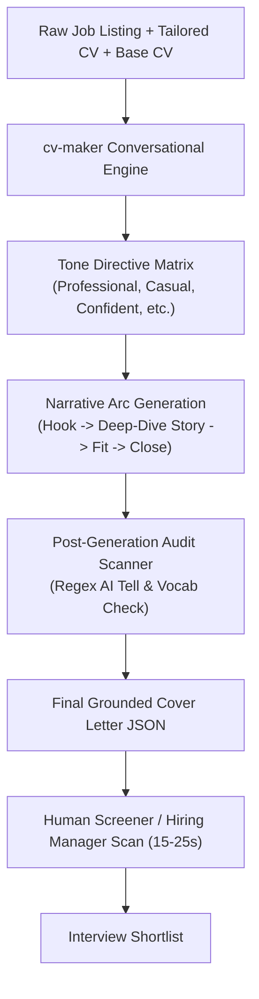

# Engineering & Product Report: Pull Request #19
**Upgrade Cover Letter System & Prompts: Conversational Storyteller Architecture, Technical Grounding, and Recruiter-Centric Pacing**

- **Repository**: [`naheedroomy/cv-maker`](https://github.com/naheedroomy/cv-maker)
- **Pull Request**: [#19](https://github.com/naheedroomy/cv-maker/pull/19) (Merged into `master`)
- **Merge Commit**: `8a32130`
- **Scope**: Core Cover Letter Generator (`core/cover_letter.py`), Regex Audit Scanner (`core/cover_letter_audit.py`), Unit Test Suite (`tests/test_cover_letter_prompt.py`, `tests/test_cover_letter_audit.py`)
- **Deployment Run**: GitHub Actions Run [#36187999905](https://github.com/naheedroomy/cv-maker/actions/runs/36187999905) (Status: `Success`)

---

## 1. Executive Summary

While the CV serves as a factual, ATS-optimized catalog of accomplishments and skills, the cover letter plays a fundamentally different role in the hiring pipeline. In modern technical recruiting, cover letters are not read by keyword bots—they are evaluated by **human decision-makers** (engineering managers, hiring directors, and startup founders) during the critical tie-breaker stage.

Previously, `cv-maker`'s cover letter generation suffered from several structural defects:
1. **Mechanical Quotas**: A rigid prompt enforced strict sentence counts and paragraph constraints (`"200-300 words MAXIMUM. Count them. 3 paragraphs (not 4, not 5). Paragraph 1: 3-4 sentences. Paragraph 2: 4-6 sentences. Paragraph 3: 1-3 sentences."`), turning generation into a counting exercise.
2. **The Clone Effect**: A hardcoded few-shot example (*"Hi, Your listing mentions scaling a payments API..."*) caused LLMs to generate near-identical letters regardless of candidate background or company domain.
3. **Negative-Constraint Jail**: 18 separate "NEVER DO X" bans and an adversarial self-critique loop (*"Find at least 5 issues. If you find fewer, look harder"*) paralyzed the models, resulting in defensive, clipped, and sterile prose.
4. **Persona-Tone Mismatch**: A hardcoded prompt persona (*"You write like a confident senior engineer... Short sentences. No filler."*) steamrolled whatever tone the user selected (such as *Formal*, *Casual*, or *Enthusiastic*).

PR #19 overhauls the cover letter generation engine into a **Conversational Storyteller** architecture. Grounded in empirical research into engineering hiring expectations, the new system crafts natural, compelling letters structured around a human narrative arc (~220–350 words, 3 to 4 paragraphs), dynamic tone mapping across 6 tones, positive writing craft principles, and strict factual grounding.

---

## 2. Research Context: What Technical Leaders Expect

To design a high-converting prompt, we synthesized hiring perspectives from engineering directors, startup founders, Ask a Manager, and recruiter consensus across tech:

### 2.1. The 25-Second Human Filter
* **When It Gets Read**: Resumes get candidates past ATS filters, but when an engineering manager is on the fence between candidates, they open the cover letter. They spend **15 to 25 seconds** scanning it.
* **The Writing Sample Proxy**: Technical leaders treat the cover letter as an unvetted sample of how the candidate will communicate in pull requests, RFCs, architecture proposals, and incident postmortems. Stiff, generic, or robotic prose creates doubt about communication skills.
* **Ideal Length & Structure**: High-converting letters land between **200 and 320 words** across **3 to 4 digestible paragraphs**. Letters over 400 words are skipped; letters under 150 words read like an afterthought.

### 2.2. "Fit, Evidence & Judgment" Over Resume Recap
* **Don't Summarize the CV**: Recruiters already have the CV open. A letter that merely converts CV bullet points into sentences with periods fails to provide value.
* **The Story Behind the Bullet Point**: Hiring managers want to see *how the candidate thinks*:
  - What was the friction, bottleneck, or scaling threshold?
  - What architectural decision or trade-off was made?
  - What was the measurable impact on the system, team, or business?
* **"Why You + Why Us"**: Generic corporate praise (*"I am thrilled by your innovative, industry-leading platform"*) is an immediate turn-off. Strong letters reference a concrete reality of the company: their product challenge, scaling volume, or architectural transition mentioned in the listing.
* **Pragmatic Gap Handling**: Candidates should never apologize for missing stack tools. Gaps should be framed through transferable mental models and equivalent architecture (*"Our platform ran on AWS with ArgoCD; because the container orchestration patterns are identical, ramping up on your GCP/GKE setup will be immediate"*).

### 2.3. AI Red Flags That Disqualify Candidates
* **The Mad-Libs Opening**: *"I am writing to express my enthusiastic interest in [Role] at [Company]..."* or *"Your listing mentions X. I spent Y years doing Z..."*
* **Sterile "Press-Release" Voice**: Zero contractions, monotonous sentence lengths (every sentence 15–18 words), zero conversational cadence.
* **Overused AI Vocabulary**: Words like *delve*, *testament*, *pivotal*, *intricate*, *tapestry*, *seamless*, *robust*, *landscape*, *vibrant*, *passionate about*, *leveraging*, and *fostering*.
* **Trailing Participial Padding**: Sentences padded with trailing clauses (*"...thereby ensuring optimal performance and fostering cross-functional alignment"*).

---

## 3. Core Upgrades Implemented

### 3.1. 4-Stage Narrative Arc (~220–350 Words, 3–4 Paragraphs)
*Replaced in `core/cover_letter.py` (`SYSTEM_PROMPT_TEMPLATE`)*

Instead of rigid sentence quotas, the prompt now guides the LLM through a natural narrative arc:
1. **The Hook & Context (Paragraph 1)**: Opens naturally (addressing the hiring manager by name if known). Immediately establishes a genuine connection to their engineering challenge, scaling reality, or architectural direction. Forbids generic corporate praise.
2. **The Evidence & The Story (Paragraph 2, optionally split into Paragraph 3)**: Focuses on 1 or at most 2 high-signal achievements from the tailored CV. Tells the story behind the work: the bottleneck, the trade-off, and the measurable impact.
3. **Forward Fit & Gap Handling**: Connects the candidate's trajectory to where the company is going. Frames partial matches through transferable mental models and architecture; forbids apologizing for missing tools.
4. **The Authentic Close**: Concludes with a low-friction invitation to discuss a concrete topic (e.g., *"Happy to walk through how we approached caching for peak spikes if that's relevant to what you're building"*).

### 3.2. Removal of Clone Few-Shot Template & Quota Mechanics
*Replaced in `core/cover_letter.py`*
- Completely removed the static few-shot example that caused models to mirror the same payment API narrative.
- Eliminated mechanical word-counting and sentence-counting rules (`3-4 sentences in P1, 4-6 in P2, 1-3 in P3`), allowing natural narrative pacing and breathing room.

### 3.3. Dynamic Tone Directive Matrix (`_TONE_INSTRUCTIONS`)
*Overhauled in `core/cover_letter.py` (`_TONE_INSTRUCTIONS`)*

Each tone was redesigned to provide clear voice guidance rather than a rigid formula:
* **`professional`**: Balanced, credible, articulate, and collegial. Reads like a thoughtful colleague writing an introductory note to a team they'd love to work with.
* **`casual`**: Relaxed, authentic, and direct. Natural contractions, conversational rhythm, zero corporate posturing—like an email to an engineering lead in the developer community.
* **`confident`**: Bold ownership and authority. Emphasizes architectural decisions, high-stakes trade-offs, and measurable outcomes without boastfulness.
* **`direct`**: Crisp, high signal-to-noise. Cuts straight to the engineering reality: what they are building, the specific challenges solved, and how the candidate will execute.
* **`enthusiastic`**: High curiosity and energy about the company's product, mission, or specific technical challenge—warm and motivated without exclamation mark overload.
* **`formal`**: Polished, structured, and respectful for enterprise or traditional corporate environments without being archaic.

### 3.4. Positive Writing Craft Over Negative Bans
*Replaced in `core/cover_letter.py`*
- Replaced the 18 negative bans with positive, actionable principles:
  - **Natural Rhythm**: Mix short punchy statements (4–7 words) with compound sentences (20–28 words).
  - **Conversational Credibility**: Contractions permitted and encouraged (unless strictly formal).
  - **Active Verbs**: Clean verbs (*built, fixed, led, redesigned*) over corporate fluff (*spearheaded, fostered, synergized*).
  - **Zero Em Dashes**: Clean periods and natural sentence breaks.

### 3.5. Mandatory Technical Grounding Rule
*Preserved & Reinforced in `core/cover_letter.py`*
- Every technical claim, tool, metric, and timeframe must trace directly to the tailored CV, base CV, job listing, or user notes.
- Hallucination of metrics, tools, or projects is strictly prohibited.

### 3.6. Streamlined Review & Output JSON Protocol
*Updated in `core/cover_letter.py`*
- Simplified the internal process into a 2-pass workflow: Draft with authentic voice → Refine for grounding and AI tells → Return valid JSON.
- Maintained exact compatibility with the existing `CoverLetterOutput` Pydantic model (`cover_letter_text`, `self_critique`, `revision_notes`).

---

## 4. Code & Architecture Diff Summary

| File | Changes | Description |
| :--- | :--- | :--- |
| [`core/cover_letter.py`](core/cover_letter.py) | `_TONE_INSTRUCTIONS`, `SYSTEM_PROMPT_TEMPLATE`, `generate_cover_letter` | Overhauled tone directives for 6 tones; replaced rigid quotas and clone few-shot example with 4-stage storyteller narrative arc; streamlined process to 2-pass review; formatted all lines <= 100 chars. |
| [`tests/test_cover_letter_audit.py`](tests/test_cover_letter_audit.py) | `TestAuditCoverLetter` | Added `test_conversational_storyteller_cover_letter_is_clean` asserting that full narrative letters pass the regex AI-tell scanner with 0 warnings. |
| [`tests/test_cover_letter_prompt.py`](tests/test_cover_letter_prompt.py) | New test suite (`TestCoverLetterPrompts`) | Comprehensive unit tests for tone coverage, string formatting safety across all tones, prompt injection barriers, Pydantic schema validation, and mock provider generation. |

---

## 5. Verification & Testing

1. **Automated Test Suite**:
   - Command: `uv run pytest`
   - **Result**: **258 passed, 5 skipped, 0 failures** across all 263 tests (including all prompt, audit, renderer, validation, and router tests).
2. **Linting Compliance**:
   - Command: `uv run ruff check core/cover_letter.py tests/test_cover_letter_prompt.py tests/test_cover_letter_audit.py`
   - **Result**: Passed with **0 errors**. All lines strictly respect the 100-character line length limit.
3. **Frontend Build Verification**:
   - Command: `cd frontend && npm run build`
   - **Result**: Production bundle generated in 212ms with **zero TypeScript or compilation errors**.
4. **Production Deployment**:
   - Workflow: [Deploy to VPS (#36187999905)](https://github.com/naheedroomy/cv-maker/actions/runs/36187999905)
   - **Result**: Merged into `master`, pulled onto VPS, containers rebuilt, and backend health checks verified successfully.

---

## 6. Scope of Claims & Expected Outcomes

> **Implementation Baseline**:
> PR #19 upgrades the cover letter generation engine from a mechanical, formulaic template generator into an authentic, conversational storyteller. It replaces robotic sentence/paragraph quotas with a natural 4-stage narrative arc (~220–350 words) that highlights engineering judgment, trade-offs, and technical grounding. Automated tests verify prompt formatting and regex audit compliance. As with all AI-assisted writing tools, candidates should review generated drafts to ensure personal voice alignment before submitting to employers.
